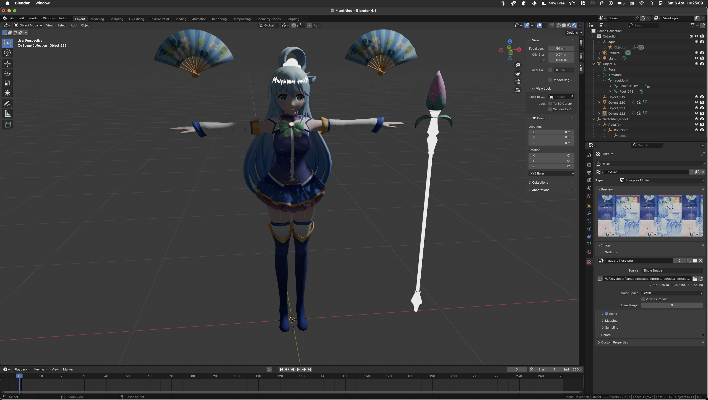

# Aqua-Waifu 

> [!IMPORTANT]
> This project is a work in progress and is not yet ready for production use. Please refer to the [Contributing](#contributing) section for more information on how to contribute to this project.

Welcome to "aqua-waifu", a game developed with the Bevy engine. This project aims to create an engaging experience with customizable controls and immersive gameplay mechanics.

## Features
I have been having quite some fun with this project, ngl 


- **Customizable Window Settings**: Launches in a 1920x1080 window, centered on the primary monitor with immediate present mode for reduced latency.
- **Dynamic Camera Controls**: Includes mouse-driven camera movement for a full range of looking around in the game world.
- **Player Movement**: Supports basic movement controls (WASD for movement, space for jumping) and camera control with arrow keys.
- **Development Tools**: Integrates Bevy's FrameTimeDiagnosticsPlugin in debug builds for performance monitoring.

## Getting Started

To get started with "aqua-waifu", follow these steps:

### Prerequisites

- Rust programming language setup on your machine.
- Basic understanding of Rust and the Bevy game engine.

### Installation

1. **Clone the Repository**

   ```bash
   git clone https://your-repository-url/aqua-waifu.git
   cd aqua-waifu
   ```

2. **Run the Game**

   ```bash
   cargo run --release
   ```

## Controls

- **Movement**: Use `W`, `A`, `S`, `D` to move forward, left, backward, and right, respectively.
- **Jump**: Press `Space` to jump.
- **Camera Control**: Move your mouse to look around. Use the arrow keys for additional camera control.
- **Shoot/Interact**: (Planned feature, not yet implemented)

## Modules

- **Player**: Handles player states and controls.
- **Setup**: Initial setup for the game, including spawning the player and setting up the environment.
- **Camera**: Manages camera movements based on mouse and keyboard input.

## Debugging

In debug mode, the game runs with additional diagnostics enabled, providing insights into frame timings which are crucial for performance tuning.

## Contributing

Contributions to "aqua-waifu" are welcome! Please read `CONTRIBUTING.md` for guidelines on how to contribute to this project.

## License

This project is licensed under [MIT License](LICENSE). See the LICENSE file for more details.

## Acknowledgments

- Bevy Engine Team for providing an excellent ECS game engine.
- The Rust Community for continuous support and resources.
